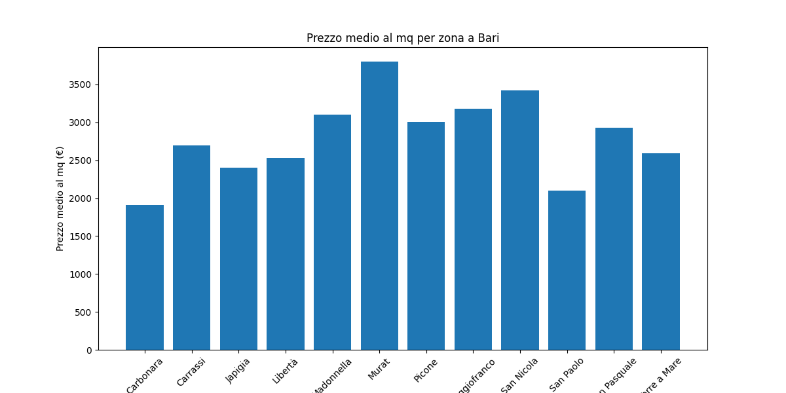
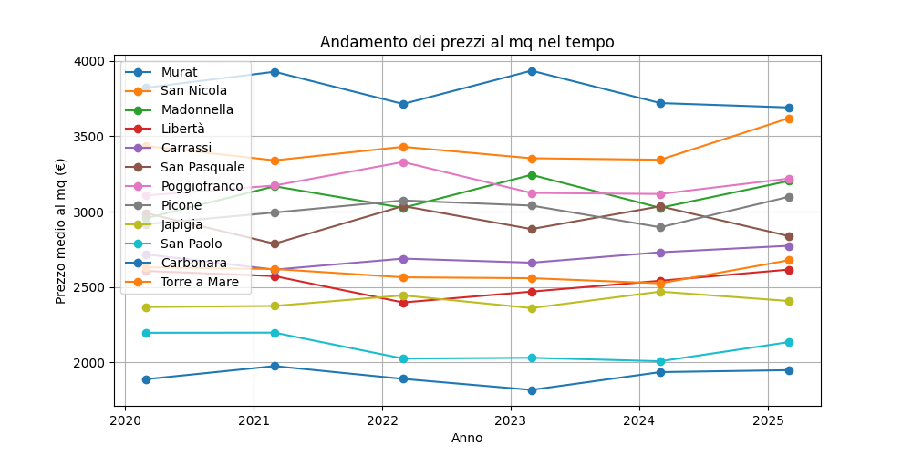

# 📊 Analisi del Mercato Immobiliare di Bari 

Questo progetto in Python vuole analizzare l'andamento del mercato immobiliare di Bari utilizzando **Pandas, NumPy, Matplotlib e Scikit-Learn**. Il codice esegue un'analisi approfondita dei prezzi medi al metro quadro per zona e prevede l'andamento futuro dei prezzi.

## 📂 Struttura del Progetto

```
📂 Analisi_Mercato_Immobiliare_Bari
│── 📂 utils
│   │── data_loader.py       # Funzione per caricare il dataset
│   │── analysis.py          # Funzioni per analisi e visualizzazione dati
│
│── main.py                  # Script principale per eseguire l'analisi
│── prezzi_immobiliari_bari_storico.csv  # Dataset utilizzato
│── requirements.txt          # Dipendenze del progetto
│── README.md                 # Documentazione
```

## 🚀 Installazione

1. **Clona il repository**
   ```sh
   git clone https://github.com/tuo-utente/Analisi_Mercato_Immobiliare_Bari.git
   cd Analisi_Mercato_Immobiliare_Bari
   ```

2. **Crea e attiva un ambiente virtuale (opzionale ma consigliato)**
   ```sh
   python -m venv .venv
   source .venv/bin/activate  # macOS/Linux
   .venv\Scripts\activate  # Windows
   ```

3. **Installa le dipendenze**
   ```sh
   pip install -r requirements.txt
   ```

## 📊 Funzionalità

✔ **Caricamento del dataset** con `Pandas`  
✔ **Analisi descrittiva**: media, mediana, deviazione standard dei prezzi  
✔ **Visualizzazione grafica** con `Matplotlib`: trend temporali e distribuzione dei prezzi per zona  
✔ **Previsioni dei prezzi futuri** con `Scikit-Learn`  

## 🏗️ Utilizzo

Esegui lo script principale:

```sh
python main.py
```

I risultati includeranno:
- Un **grafico a barre** con i prezzi medi per zona 📊
- Un **grafico di trend temporale** per tutti i quartieri 📈
- Un **grafico di previsione** dei prezzi futuri per ogni quartiere 📉

## 📷 Esempio di Output

Questo è un esempio di output generato dal progetto:




##  📞 Contatti:
👤 **Fabrizio Mileto**  
📧 Email: [mileto144@gmail.com](mailto:tuaemail@example.com)  
📂 GitHub: [https://github.com/fabriziomileto8](https://github.com/TUO-USERNAME)  
📌 LinkedIn: [https://www.linkedin.com/in/fabrizio-mileto-94681b16b/](https://linkedin.com/in/TUO-NOME)  


